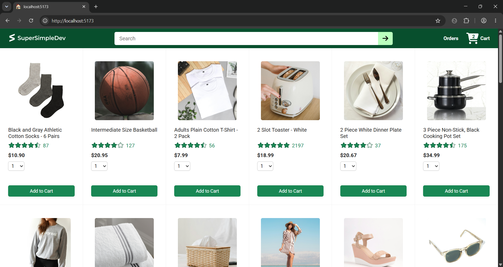
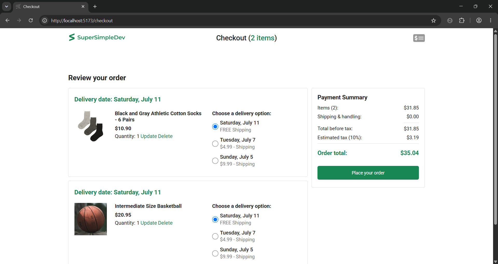
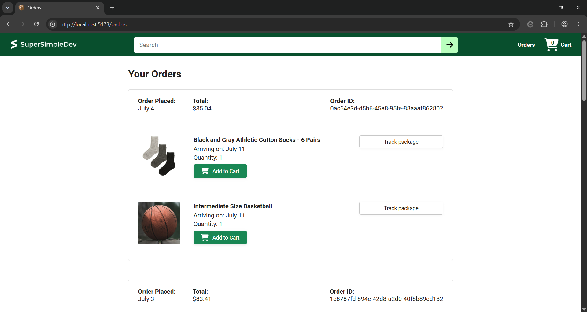

# Ecommerce App

A full-stack ecommerce application built with a React frontend and a Node.js backend. The project simulates a modern online shopping experience with product browsing, cart management, checkout, order tracking, and backend API integration.

## Screenshots





---

## Demo Video

[▶️ Watch the project demo](ecommerce-app.mp4)

---

## Project Structure

```text
ecommerce-app/
├── ecommerce-project/      # React frontend
└── ecommerce-backend/      # Node.js/Express backend
```

The frontend and backend are maintained in the same repository because the frontend depends on the backend API during development.

---

## Features

- Browse products
- Add and remove items from the shopping cart
- Checkout workflow
- Order summary
- Delivery tracking page
- Responsive user interface
- Backend REST API integration
- Production frontend build served through the backend
- Automated unit testing with Vitest

---

## Technologies Used

### Frontend

- React
- TypeScript
- Vite
- React Router
- Axios
- Day.js
- CSS

### Backend

- Node.js
- Express.js
- REST API

### Testing

- Vitest

### Development Tools

- Git & GitHub
- Visual Studio Code
- npm

---

## What I Learned

This project helped me gain experience with:

- Building a multi-page React application
- Creating reusable React components
- Managing application state
- Client-side routing with React Router
- Communicating with backend APIs using Axios
- Organizing a full-stack project
- Building production-ready applications with Vite
- Writing and running automated tests with Vitest
- Debugging frontend and backend issues
- Using Git for version control throughout development

---

## Running the Project

### Clone the repository

```bash
git clone https://github.com/Jenpj234/ecommerce-app.git
cd ecommerce-app
```

### Install frontend dependencies

```bash
cd ecommerce-project
npm install
```

### Install backend dependencies

```bash
cd ../ecommerce-backend
npm install
```

### Start the backend

```bash
npm start
```

### Start the frontend

Open another terminal:

```bash
cd ecommerce-project
npm run dev
```

---

## Running Tests

From the frontend directory:

```bash
npx vitest 
```

---

## Building the Frontend

From the frontend directory:

```bash
npm run build
```

The frontend is configured to generate a production build that can be served by the backend.

---

## Project Status

This project was built as a learning exercise while gaining experience with modern full-stack web development using React and Node.js. Additional improvements and features may be added over time.

---
